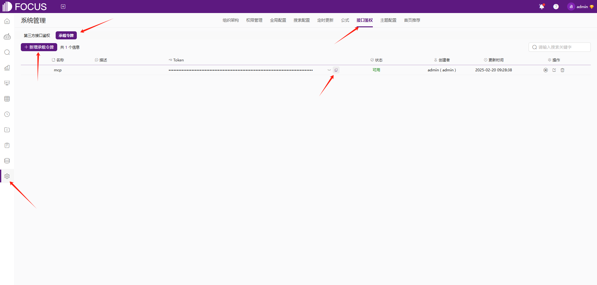
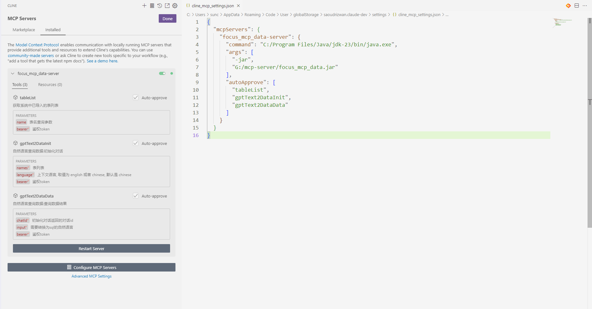
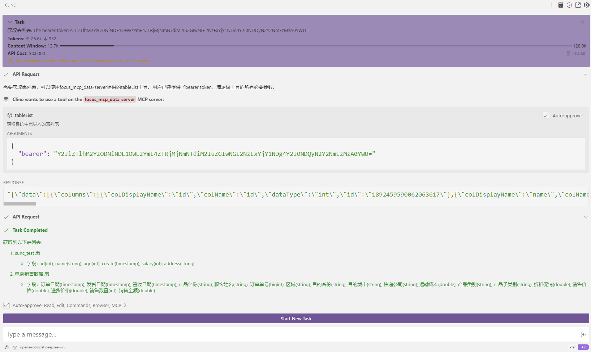
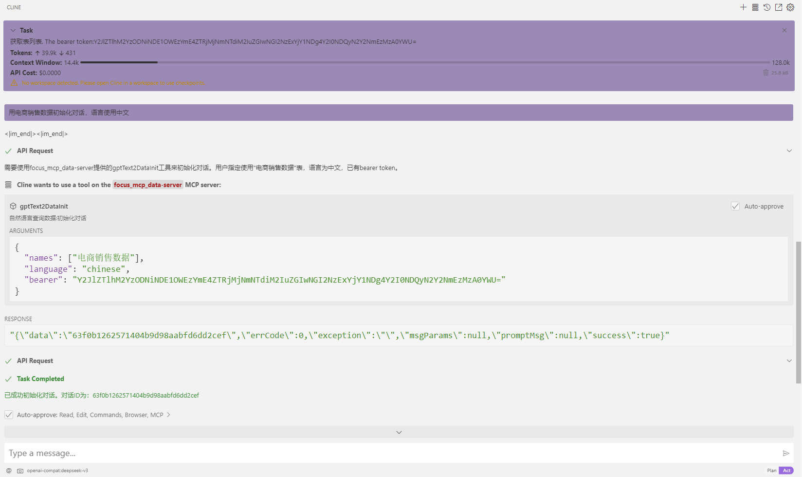
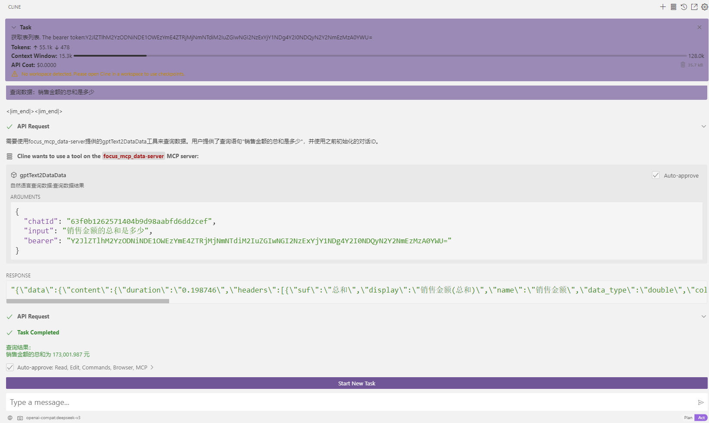

# FOCUS DATA MCP Server [[English](./README.md)]

模型上下文协议（MCP）服务器使人工智能助手能够直接查询数据结果。用户以自然语言获取数据结果。

## 特征

- 选择Datafocus数据表初始化对话框
- 通过自然语言提问获取查询结果

## 准备

- jdk 23 或者以上版本。 [下载jdk](https://www.oracle.com/java/technologies/downloads/)
- gradle 8.12 或者以上版本。 [下载gradle](https://gradle.org/install/)
- 注册 [Datafocus](https://www.datafocus.ai/) 账号获取 Bearer Token: 
    1. 进入 [Datafocus](https://www.datafocus.ai/) 官网注册账号
    2. 创建一个应用
    3. 进入应用
    4. 系统配置 -> 接口鉴权 -> 承载令牌 -> 新增承载令牌
       

## 安装

1. Clone this repository:

```bash
git clone https://github.com/FocusSearch/focus_mcp_data.git
cd focus_mcp_data
```

2. Build the server:

```bash
gradle clean
gradle bootJar

生成的 jar 包路径: build/libs/focus_mcp_data.jar
```

## MCP 配置文件

添加一下配置到 MCP 的配置文件 (通常在以下目录 `~/AppData/Roaming/Code/User/globalStorage/saoudrizwan.claude-dev/settings/cline_mcp_settings.json`):

```json
{
  "mcpServers": {
    "focus_mcp_data": {
      "command": "java",
      "args": [
        "-jar",
        "path/to/focus_mcp_data/focus_mcp_data.jar"
      ],
      "autoApprove": [
        "tableList",
        "gptText2DataInit",
        "gptText2DataData"
      ]
    }
  }
}
```

## 可用的工具列表

### 1. tableList

获取 Datafocus 的表列表.

**参数:**

- `name` (可选): 需要查找的表名
- `bearer` (必须): bearer token

**样例:**

```json
{
  "name": "test",
  "bearer": "ZTllYzAzZjM2YzA3NDA0ZGE3ZjguNDJhNDjNGU4NzkyYjY1OTY0YzUxYWU5NmU="
}
```

### 2. gptText2DataInit

初始化对话.

**参数:**

- `names` (必须): 选择的表名列表
- `bearer` (必须): bearer token
- `language` (可选): 语言 ['english','chinese']

**样例:**

```json
{
  "names": [
    "test1",
    "test2"
  ],
  "bearer": "ZTllYzAzZjM2YzA3NDA0ZGE3ZjguNDJhNDjNGU4NzkyYjY1OTY0YzUxYWU5NmU="
}
```

### 3. gptText2DataData

对话获取查询结果.

**参数:**

- `chatId` (必须): 初始化对话的对话id
- `input` (必须): 需要查询的自然语言
- `bearer` (必须): bearer token

**样例:**

```json
{
  "chatId": "03975af5de4b4562938a985403f206d4",
  "input": "max(age)",
  "bearer": "ZTllYzAzZjM2YzA3NDA0ZGE3ZjguNDJhNDjNGU4NzkyYjY1OTY0YzUxYWU5NmU="
}
```

## 响应结构

工具返回的数据结构如下:

```json
{
  "errCode": 0,
  "exception": "",
  "msgParams": null,
  "promptMsg": null,
  "success": true,
  "data": {
  }
}
```

## Visual Studio Code Cline 示例

1. vsCode 安装cline插件
2. 配置 mcp server
   
3. 使用
    1. 获取表列表
       
    2. 初始化
       
    3. 查询数据：销售金额的总和是多少
       